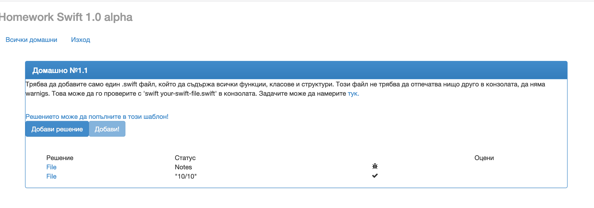
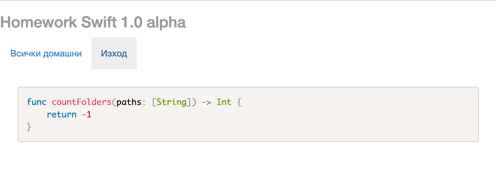

## Първото задание за самостоятелна домашна работа

Решениятo на всяка задача ще трябва да качите в нашия портал на следния адрес - [http://swiftfmi.apposestudio.com/](http://swiftfmi.apposestudio.com/register)

Всеки __ТРЯБВА__ да се регистрира с факултетния си номер.


За всяка задача, ще имате определена страница, където ще може да видите колко точки получавате.



Трябва да свалите шаблона и да попълните решението в него. Не оставяйте ненужни `print` извиквания във вашето решение. Системата няма да може да оцени некоректни решения и ще покаже съответната икона.



Ако имате някакви въпроси за системата, моля пишете на имейла за контакт.

Крайният срок за качване на решенията е _04.04.2023_!


## Задачи:

1. Нека имаме списък от символни низове. Всеки символен низ описва една заява за обработка на задача. Работното време е от 00:00 до 24:00. Всяка заявка има пореден номер, приоритет (позитивно цяло число, по-голямата стойност - по спешна задача), име, начален час и продължителност в минути. (изпозлва се `,` за разделител) Да се реализира функция, която определя първия свободен час и неговата продължителност, ако системата, която може да обработва задачите знаем, че обработва точно по една задача.

    Ето и пример:
    ```swift
    "1,10,Clean,00:00,60"
    "2,10,Build,00:00,10"
    "3,10,Run,00:00,20"
    "4,100,Checkout,00:00,30"
    "5,100,Upload,02:30,30"
    ------ изчисления
    00:00 - 00:30 - Checkout
    00:30 - 01:30 - Clean
    01:30 - 01:40 - Build
    01:40 - 02:00 - Run
    02:00 - 02:30 - [Slot]
    02:30 - 03:00 - Upload
    
    (02:00,30) - Първия свободен час е "02:00" с продължителност 30 мин.
    ```

    Напишете функция `freeSlot(list: [String]) -> (String, Int)`, която да анализира входните данни, като отчита приоритета, началния час и продължителността на заявките. Следните правила ще са в сила за входните данни.

    1. Началния час и продължителността няма да надхвърлят интервала от 24 часа.
    1. Ако има две заявки с еднакъв начален час, тогава се гледа тяхния ред на записване и приоритет. (Приоритета има по-голяма тежест.)
    1. Изпълнява се винаги само една заявка.
    1. Всяка заявка взема първия свободен слот, ако не може да бъде започната в уречения час.
    1. Последния час се приема като край на интервала.
    > Заявките избутват всички други с по-нисък приоритет.

    Пример - за следните входни данни: 

    ```swift
    "1,10,Clean,00:00,60"
    "2,10,Build,00:00,10"
    "3,10,Run,00:00,20"
    "4,100,Checkout,00:00,30"
    "5,100,Upload,01:41,30"
    ------ изчисления
    00:00 - 00:30 - Checkout
    00:30 - 01:30 - Clean
    01:30 - 01:40 - Build
    01:40 - 02:00 - Run
    02:00 - 02:30 - Upload
    (02:30,1290) - Първия свободен час е "02:30" с продължителност (30 + 21 * 60) мин.
    ```
    Примерна имплементация, която може да използвате в системата.
    
    > Всяка задача има шаблон, който трябва да свалите. В него попълвате решението, като не променяте името на основната функция и качвате файла. Трябва да не отпечатванте нищо в конзолата, за да получите оценка.

    ```swift
    func freeSlot(list: [String]) -> (String, Int) {
        return ("00:00", 24 * 60)
    }
    ```

2. Да се нaпише функция, която пресмята стойността на прост математически израз от вида по-долу, подаден като `String` препоръчва се използването на рекурсия:
	
	__Скобите ще са винаги налични и изразът ще е коректен!__

    > Рекусривното решение лесно може да постои двоично дърво от израза и да го пресметне, понеже са позволени само бинарни операции.
    > Ще се приемат всякакви решения.
	
	Пример: 
		
		((23 + 6) * 2)
	
	Възможните операции са ```^(степенуване), *, /,  +, - ```.
	```swift
	func evaluate(expression: String) -> Double {
		//TODO: your implementation goes here
		return 0.0
	}
	```
	
3. Да се напише функция, която намира броят на различните пътища в лабиринт, зададен в двумерен масив (матрица). Ако няма път, да връща ```0```.

	_Препоръчително е да се използват помощни функции и структури._
 
	Пример: 
		
		^ 0 0 0 0 0 0 1
		0 1 1 1 1 1 0 0
		0 0 0 0 0 1 # 1
		0 1 1 1 0 1 0 0
		0 1 0 1 0 0 0 1
		0 0 0 1 0 1 0 *

```swift
    var testMaze = [
        ["^", "0", "0", "0", "0", "0", "0", "1"],
		["0", "1", "1", "1", "1", "1", "0", "0"],
		["0", "0", "0", "0", "0", "1", "#", "1"],
		["0", "1", "1", "1", "0", "1", "0", "0"],
		["0", "1", "0", "1", "0", "0", "0", "1"],
		["0", "0", "0", "1", "0", "1", "0", "*"]]
```
        
    Извикването на функцията, трябва да връща: 
    
           1

	Където:
	
		0 е проходимо поле
		1 е непроходимо поле
		^ е началната позиция
		* е крайната позиция
        # е непроходимо поле


Примeрна функция:
```Swift           
	protocol Maze {
		init(raw: [[String]])
		...
	}
	
	func findPaths(maze: [[String]]) -> Int {
	    // TODO: your implementation goes here
        return -1
    }
```
